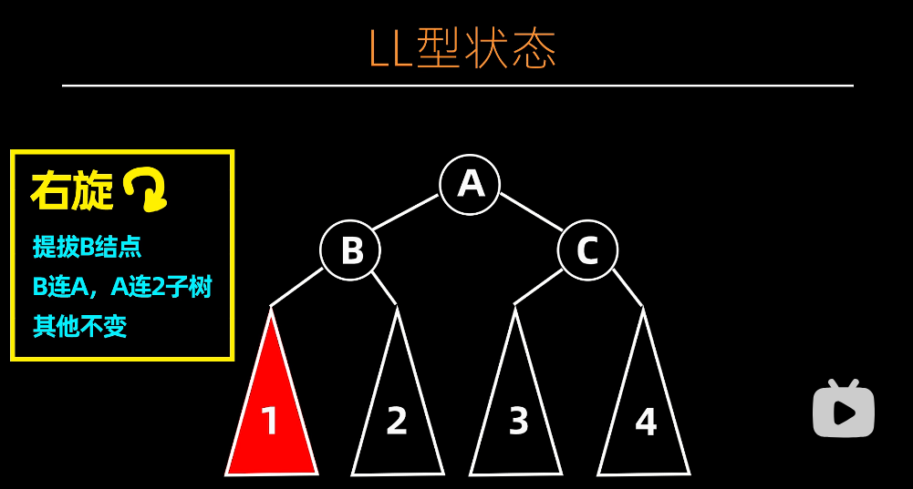
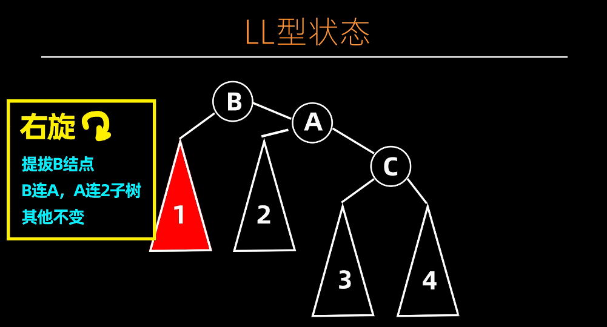
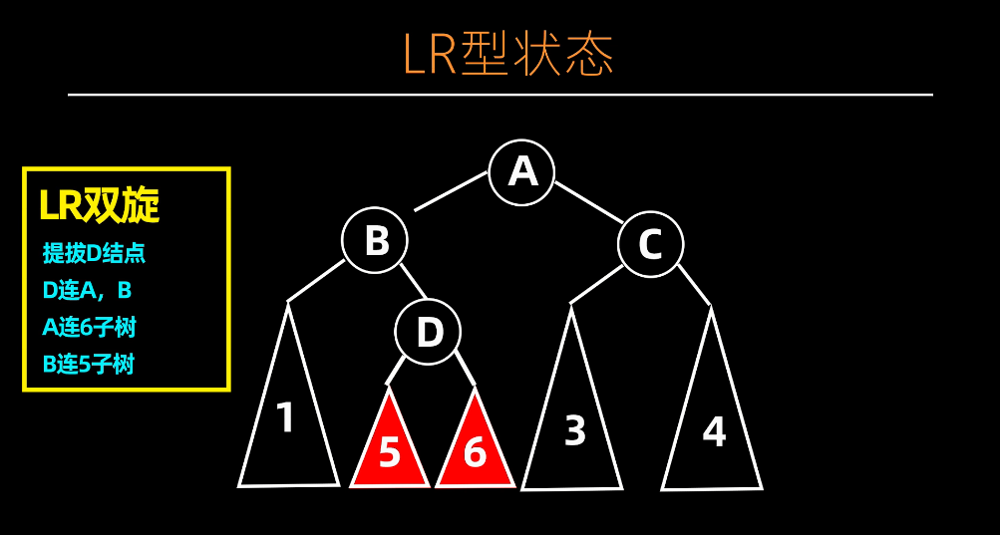
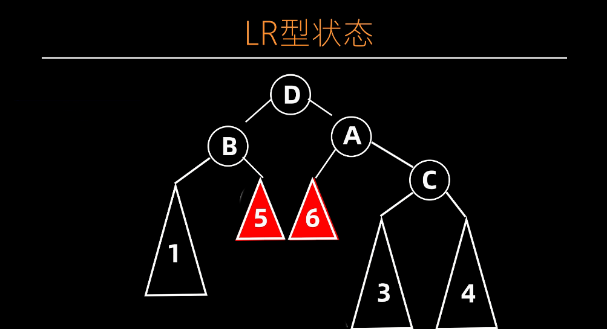
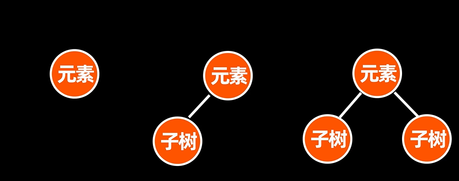

# AVL 树

## 插入和搜索操作

AVL树的搜索操作与二叉搜索树基本一致。插入操作也与二叉搜索树一致，但是插入后还需要进行调整操作。

## AVL 树的调整

AVL树在经过插入、删除某些节点后，会导致树的高度失衡。这时候需要对树进行调整。下面以 LL 和 LR 型两种状态进行举例说明。

至于 RR 和 RL型状态，可以类比得出。

### LL 型

调整前


调整后


### LR 型

调整前


调整后


## AVL 树删除操作



如上图所示，被删除的节点有三种情况：叶子结点、有一颗子结点和两颗子结点。

- 如果是情况 1 ，直接移除该结点即可。然后调整 AVL 树至平衡。
- 如果是情况 2 ，令子节点取代父结点位置，原父结点删除，再调整至平衡即可。
- 如果是情况 3 ，令其中序后驱结点取代父结点，原父结点删除，再调整至平衡即可。

删除后，找到最高的子树进行调整即可。

## 编程实现

下面是使用C语言实现AVL树的示例代码，包括插入、删除和搜索等基本操作：

```c
#include <stdio.h>
#include <stdlib.h>

// AVL树节点的定义
typedef struct AVLNode {
    int data;
    struct AVLNode* left;
    struct AVLNode* right;
    int height;
} AVLNode;

// 获取节点的高度
int getHeight(AVLNode* node) {
    if (node == NULL) {
        return 0;
    }
    return node->height;
}

// 计算节点的平衡因子
int getBalanceFactor(AVLNode* node) {
    if (node == NULL) {
        return 0;
    }
    return getHeight(node->left) - getHeight(node->right);
}

// 更新节点的高度
void updateHeight(AVLNode* node) {
    if (node == NULL) {
        return;
    }
    int leftHeight = getHeight(node->left);
    int rightHeight = getHeight(node->right);
    node->height = (leftHeight > rightHeight ? leftHeight : rightHeight) + 1;
}

// 创建新节点
AVLNode* createNode(int data) {
    AVLNode* newNode = (AVLNode*)malloc(sizeof(AVLNode));
    newNode->data = data;
    newNode->left = NULL;
    newNode->right = NULL;
    newNode->height = 1;
    return newNode;
}

// 右旋操作
AVLNode* rightRotate(AVLNode* node) {
    AVLNode* newRoot = node->left;
    node->left = newRoot->right;
    newRoot->right = node;
    updateHeight(node);
    updateHeight(newRoot);
    return newRoot;
}

// 左旋操作
AVLNode* leftRotate(AVLNode* node) {
    AVLNode* newRoot = node->right;
    node->right = newRoot->left;
    newRoot->left = node;
    updateHeight(node);
    updateHeight(newRoot);
    return newRoot;
}

// 平衡调整
AVLNode* balance(AVLNode* node) {
    if (node == NULL) {
        return NULL;
    }
    updateHeight(node);
    int balanceFactor = getBalanceFactor(node);
    if (balanceFactor > 1) {
        if (getBalanceFactor(node->left) < 0) {
            node->left = leftRotate(node->left);
        }
        return rightRotate(node);
    } else if (balanceFactor < -1) {
        if (getBalanceFactor(node->right) > 0) {
            node->right = rightRotate(node->right);
        }
        return leftRotate(node);
    }
    return node;
}

// 插入节点
AVLNode* insert(AVLNode* root, int data) {
    if (root == NULL) {
        return createNode(data);
    }
    if (data < root->data) {
        root->left = insert(root->left, data);
    } else if (data > root->data) {
        root->right = insert(root->right, data);
    } else {
        // 已存在相同值的节点，不进行插入
        return root;
    }
    return balance(root);
}

// 查找节点
AVLNode* search(AVLNode* root, int data) {
    if (root == NULL || root->data == data) {
        return root;
    }
    if (data < root->data) {
        return search(root->left, data);
    } else {
        return search(root->right, data);
    }
}

// 找到以node为根节点的子树中的最小节点
AVLNode* findMinNode(AVLNode* node) {
    AVLNode* current = node;
    while (current->left != NULL) {
        current = current->left;
    }
    return current;
}

// 删除节点
AVLNode* deleteNode(AVLNode* root, int data) {
    if (root == NULL) {
        return root;
    }
    if (data < root->data) {
        root->left = deleteNode(root->left, data);
    } else if (data > root->data) {
        root->right = deleteNode(root->right, data);
    } else {
        if (root->left == NULL || root->right == NULL) {
            AVLNode* temp = root->left ? root->left : root->right;
            if (temp == NULL) {
                temp = root;
                root = NULL;
            } else {
                *root = *temp;
            }
            free(temp);
        } else {
            AVLNode* temp = findMinNode(root->right);
            root->data = temp->data;
            root->right = deleteNode(root->right, temp->data);
        }
    }
    if (root == NULL) {
        return root;
    }
    return balance(root);
}

// 中序遍历打印树
void inorderTraversal(AVLNode* root) {
    if (root == NULL) {
        return;
    }
    inorderTraversal(root->left);
    printf("%d ", root->data);
    inorderTraversal(root->right);
}

// 测试代码
int main() {
    AVLNode* root = NULL;

    // 插入节点
    root = insert(root, 10);
    root = insert(root, 20);
    root = insert(root, 30);
    root = insert(root, 40);
    root = insert(root, 50);
    root = insert(root, 25);

    // 打印树
    printf("中序遍历结果：");
    inorderTraversal(root);
    printf("\n");

    // 搜索节点
    int searchData = 30;
    AVLNode* searchResult = search(root, searchData);
    if (searchResult != NULL) {
        printf("节点 %d 存在于树中。\n", searchData);
    } else {
        printf("节点 %d 不存在于树中。\n", searchData);
    }

    // 删除节点
    int deleteData = 40;
    root = deleteNode(root, deleteData);
    printf("删除节点 %d 后的中序遍历结果：", deleteData);
    inorderTraversal(root);
    printf("\n");

    // 释放内存
    free(root);

    return 0;
}
```

在上述示例代码中，我们定义了一个 `AVLNode` 结构体来表示AVL树的节点。每个节点包含数据成员 `data`、`left` 指针和 `right` 指针，以及一个 `height` 成员用于记录节点的高度。

然后，我们提供了一些基本操作函数：

- `getHeight`：获取节点的高度。
- `getBalanceFactor`：计算节点的平衡因子。
- `updateHeight`：更新节点的高度。
- `createNode`：创建一个新的节点。
- `rightRotate`：执行右旋操作。
- `leftRotate`：执行左旋操作。
- `balance`：平衡调整节点。
- `insert`：插入节点到AVL树中。
- `search`：搜索指定值的节点。
- `findMinNode`：找到以给定节点为根的子树中的最小节点。
- `deleteNode`：删除指定值的节点。
- `inorderTraversal`：中序遍历打印树。

在 `main` 函数中，我们创建了一个示例的AVL树，并进行了插入、搜索和删除操作，并通过中序遍历打印树的节点值。

请注意，在实际使用中，你可能需要根据具体需求扩展这些基本操作，例如前序遍历、后序遍历、删除整个树等操作。同时，为了确保内存的正确释放，你需要在程序结束时释放动态分配的节点内存。

## 参考视频

<iframe src="//player.bilibili.com/player.html?aid=771038005&bvid=BV1dr4y1j7Mz&cid=776606625&p=1" scrolling="no" width="100%" height="500" border="0" frameborder="no" framespacing="0" allowfullscreen="true"> </iframe>

<iframe src="//player.bilibili.com/player.html?aid=258662669&bvid=BV15a411D7tr&cid=779100775&p=1" scrolling="no" width="100%" height="500" border="0" frameborder="no" framespacing="0" allowfullscreen="true"> </iframe>
